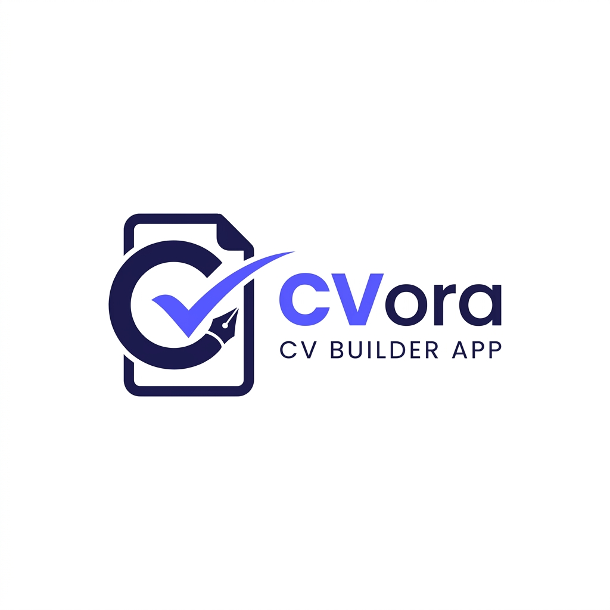

<div align="center">
  
  <br/>
  
  <h1>CVora</h1>
  <p><strong>The Professional, Privacy-First Resume Builder</strong></p>
  <p>
    
    
    
    
  </p>
</div>

---

## 🌟 Overview
**CVora** is a high-performance, privacy-focused CV Builder designed to help professionals create stunning resumes in minutes. Unlike traditional tools, CVora prioritizes your data privacy with AI-free, local PDF parsing and a seamless real-time editing experience.

### 🚀 Key Features
- **💎 8+ Premium Templates**: From "Modern" to "Executive", designed for every industry.
- **🔒 AI-Free PDF Extraction**: Local, client-side resume parsing—no data ever leaves your browser.
- **⚡ Real-Time Live Preview**: Instant updates with zoom controls and immersive fullscreen mode.
- **📱 Fully Mobile Optimized**: A desktop-grade experience on ANY device.
- **🎨 Dynamic Customization**: Change themes, accent colors, and layouts with a single click.
- **📥 One-Click Export**: Save and download high-quality PDFs ready for any ATS.

---

## 🎨 Professional Templates
Choose from our curated collection of high-impact designs:

| Template | Aesthetic | Best For |
| :------- | :-------- | :------- |
| **Modern** | Dark sidebar, two-column | Creative Tech, Startups |
| **Minimal** | Clean, single-column | Minimalists, Academic |
| **Bold** | Red header, high contrast | Marketing, Sales |
| **Elegant** | Serif fonts, gold accents | Law, Luxury, Fashion |
| **Professional** | Blue accent, icon sections | Corporate, Engineering |
| **Nova** | Gradient hero, glassmorphic | UI/UX, Design |
| **Creative** | Asymmetric, modern dots | Digital Arts, Media |
| **Executive** | Formal, double-column | Leadership, C-Suite |

---

## 🛠 Tech Stack
- **Frontend**: [Vite](https://vitejs.dev/) + [TypeScript](https://www.typescriptlang.org/)
- **Styling**: Modern Vanilla CSS with HSL-based Design Systems
- **Icons & Fonts**: [Font Awesome 6](https://fontawesome.com/) + [Google Fonts](https://fonts.google.com/) (Inter, Outfit, Playfair)
- **Deployment**: [Netlify](https://www.netlify.com/) with Netlify Blobs for sync.
- **PDF Engine**: Native Client-Side Rendering.

---

## 🏗 Getting Started

### Prerequisites
- Node.js (v18+)
- npm or yarn

### Installation
1.  **Clone the Repository**
    ```bash
    git clone https://github.com/yourusername/cvora-app.git
    cd cvora-app
    ```

2.  **Install Dependencies**
    ```bash
    npm install
    ```

3.  **Setup Environment**
    Create a `.env` file based on `.env.example`:
    ```bash
    cp .env.example .env
    ```

4.  **Run Development Server**
    ```bash
    npm run dev
    ```
    Open `http://localhost:5173` in your browser.

---

## 📸 Screenshots
*(Coming soon - The app features a stunning dark-mode dashboard and a glassmorphic builder interface.)*

---

## ⚖ License
Distributed under the **ISC License**. See `LICENSE` for more information.

---

<div align="center">
  <p>Built with ❤️ by professionals, for professionals.</p>
</div>
